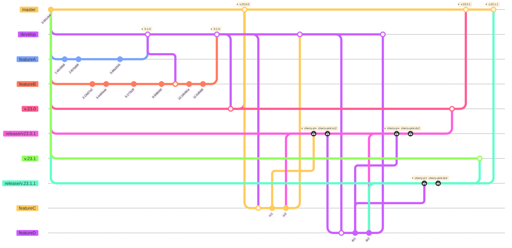
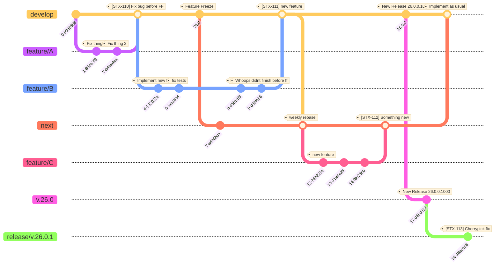

# SoftwareentwicklungsProzess mit Github

Git erlaubt es allen Entwicklern gleichzeitig Features zu entwickeln.  
Hierzu existieren diverse Techniken Git zu nutzen.
Die bekanntesten hierbei sind:

* Git Flow
* Git(Hub) Flow
* Trunk-based 

Der Github Flow ist eine vereinfachte Version des von der CMI verwendeten Git Flows.  
Für grössere Organisationen ist dieser Workflow völlig ungeeignet, weshalb hier nicht weiter auf diesen eingegangen wird.  
Infos zu diesem Flow lassen sich [direkt bei Github](https://docs.github.com/en/get-started/quickstart/github-flow) finden.

# Terminologie
Die in der CMI verwendete Versionierungs-Software lautet git, bzw. Github in seiner libgit2 Implementation.  
Git bietet hier viele Funktionalitäten.  
In diesem Dokument werden die Folgenden genutzt:

## Branch
Ein Branch bildet einen Zustand des vollständigen Codes ab und fungiert damit quasi als Zeiger auf einen bestimmten [Commit](#commit).  
Releases werden stets aus einem Branch heraus erstellt.  
Ein Branch wird in den folgenden Graphen als Linie dargestellt

## Commit
Ein Commit bildet eine Art Snapshot, der die Änderungen des Entwicklers enthält.  
Wenn ein Release gebaut wird, geschieht dies im Regelfall auf dem aktuellsten Commit des [Branches](#branch).  
Ein Commit wird in den folgenden Graphen als Knoten dargestellt.

## Merge
Als merge wird der Vorgang bezeichnet, der alle Commits ( und somit alle Änderungen ) eines Branches in einen anderen Branch übernimmt.  
Im Regelfall passiert das, sobald die Entwicklung eines Youtrack issues abgeschlossen ist.  
Der initiierende Branch des Merges wird im Anschluss an den Vorgang gelöscht.

## CherryPick
Der CherryPick erlaubt es, einen beliebigen [Commit](#commit) an der Spitze eines anderen [Branches](#branch) zu duplizieren.  
Während der [merge](#merge) es noch erzwingt, dass beide Branches den gleichen Ursprung haben ( zB aus dem gleichen Branch heraus entstanden sind ),  
muss für einen CherryPick diese Bedingung nicht erfüllt sein.  
In der Praxis geht das Brechen dieser Bedingung oft mit MergeKonflikten oder unerwünschten Seiteneffekten einher.  
Mit der steigenden Anzahl an CherryPicks wächst dieses Gefahrenpotential exponentiell.

# Git Flow
Der Gitflow ist der älteste Workflow und ist zusammen mit Git und Github gewachsen.  
In der CMI wird dieser Workflow ebenfalls verwendet und kann dann beispielsweise so aussehen:  

Die wichtigsten Branches tragen hierbei den Namen **master** und **develop**.  
Den Branch **master** ( neuerdings auch gerne **main** ) bezeichnet man ebenfalls als "Trunk".  
So wie bei einem echten Baum wird der Baumstumpf nie entfernt, sollte nicht der ganze Baum entfernt werden.  

Umkreist werden diese Branches dann von FeatureBranches, Bugfixbranches, Hotfix branches.  
Zusätzlich existieren allerdings viele trunk-ähnlichen release Branches, die in der CMI dann nach dem Entwicklungsjahr benannt sind ( e.g v.23.X )

## Vorteile
* Entwickler können vollständig dezentralisiert arbeiten und müssen nur hin und wieder ihren die Trunks in ihre Branches mergen
* Einfacher Einstieg nach Git für Junior Entwickler
* Klare Trennung zwischen Entwicklungs und Produktionsständen

## Nachteile
* Die gewaltige Menge an Releases und Patch Branches macht es fast unmöglich noch eine Übersicht zu behalten
* Cherrypicks in die ReleaseBranches werden benötigt, wodurch unerwünschte Seiteneffekte durch picken in der falschen Reihenfolge oder Merge Konfltikte passieren
* Merge Konflikte sind gross und Komplex und benötigen des Öfteren einen "Git Profi", der diese dann löst
* Sehr träge ReleaseFrequenz

## Nachteile ( CMI )
* Features müssen gebackported werden und erzeugen die Gefahr unerwünschter Seiteneffekte
* FeatureBackporting ist oft durch die veränderte Codebasis nicht möglich und benötigt dadurch veränderten Code zwischen dem Trunk, der auf der KV getestet wird,  
  und dem Release Stand, der Schlussendlich an die Kunden verteilt wird
* Features werden vor der Freigabe eines Releases kaum getestet ( hängt allerdings nur indirekt mit dem ReleaseModell zusammen )
* Viele verschiedene ReleaseStände ( Projektreleases !), obwohl der GitFlow traditionell nur einen einzigen Release Branch vorsieht
* Dll patches nehmen selbst den freigegebenen Ständen ihre Homogenität

# Trunkbased Development
Eine Alternative ist hierzu das sog. TrunkBasedDevelopment.  
Der grosse Vorteil dieser Methodik liegt darin, dass deutlich weniger Branches existieren.  
Dadruch werden weniger Cherrypicks und Tests älterer Stände benötigt.  
Als Ergebnis erzeugt dies mehr Zeit für die tatsächliche Entwicklung des Produkts.  

Dieses Verahren wird in der CMI bereits für die **meisten Microservices** ( STS, WebDav, Push, etc.) verwendet.  
Weiterhin wurde zB das **GWR3.0** Projekt nach diesem Stil erfolgreich entwickelt.  

## Vorteile
* Immens weniger Wartungsaufwand durch weniger Branches
* Sehr gute Integration in CI/CD Workflows erlaubt es zB dem PM ein Feature wöhrend der Entwicklung tatsächlich "wachsen zu sehen"
* Schnellere Releases
* Nur selten Konflikte während des [Merges](#merge)
* Keine "Feature Freezes" benötigt
* Entwickler eines Features erhalten etwas mehr Freiheiten während der Entwicklung
* Entwickler müssen weniger Zeit für die Reproduktion von Bugs aufwenden

## Nachteile
* In der Realität nur zusammen mit CI/CD hilfreich ( Ist im CMI System bereits vorhanden )
* Langlebige Feature Branches müssen ca alle 1-2 Wochen gerebased werden um merge Konflikte zu vermeiden
* Entwickler eines Features erhalten etwas mehr Freiheiten während der Entwicklung, wodurch das PM  
  dementsprechend weniger Kontrolle über die Features eines Releases hat

## Nachteile ( CMI )
* Neues Versionierungsmodell muss erst kommuniziert werden
* Möglicherweise fehlt bei manchen Kunden die Akzeptanz für dieses Model

# FeatureFreeze

Besonders der Release zum Jahreswechsel ist in seiner aktuellen Form sehr mühsam und fehleranfällig.  
Gegenwärtig werden **die meisten PRs in den release Branch gepickt**.
Aus diesem Grund können wir hier den Aufwand und die Komplexität minimieren,
indem wir die Ordnung umkehren.
Ein neuer branch **next** wird zum Featurefreeze erstellt.
Alles was **nicht** im neuen Release landen soll, wird nach **next** gemerged.

