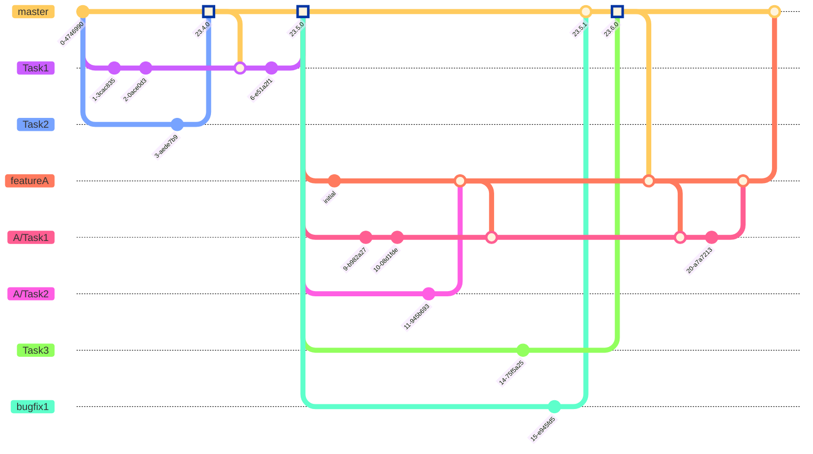

# SoftwareentwicklungsProzess mit Github

Git erlaubt es allen Entwicklern gleichzeitig Features zu entwickeln.  
Hierzu existieren diverse Techniken Git zu nutzen.
Die bekanntesten hierbei sind:

* Git Flow
* Git(Hub) Flow
* Trunk-based 

Der Github Flow ist eine vereinfachte Version des von der CMI verwendeten Git Flows.  
Für grössere Organisationen ist dieser Workflow völlig ungeeignet, weshalb dieser Aufschrieb nicht weiter darauf eingehen wird.

# Git Flow
Der Gitflow ist der älteste Workflow und ist zusammen mit Git und Github gewachsen.  
In der CMI wird dieser Workflow ebenfalls verwendet und sieht hierbei ungefähr so aus:

Der Grundbaustein sind hier der trunks **master** und **develop**. 
Umkreist werden diese dann von FeatureBranches, Bugfixbranches, Hotfix branches.

Zusätzlich existieren dann allerdings viele trunk-ähnlichen release branches, die in der CMI dann nach dem Entwicklungsjahr benannt sind ( e.g v.23.X )

## Vorteile
* Entwicklker können vollständig dezentralisiert arbeiten und müssen nur hin und wieder ihren jeweiligen Trunk mergen
* Einfacher Einstieg nach Git
* Klare Trennung zwischen Entwicklungs und Produktionsständen

## Nachteile
* Die gewaltige Menge an Releases und Patch branches macht es fast unmöglich noch eine Übersicht zu behalten
* Cherrypicks in die ReleaseBranches werden benötigt, wodurch unerwünschte Seiteneffekte durch picken in der falschen Reihenfolge oder Merge Konfltikte passieren
* Merge Konflikte sind gross und Komplex und benötigen des Öfteren einen "Git Profi", der diese dann löst
* Sehr träge ReleaseFrequenz

## Nachteile ( CMI )
* Features müssen gebackported werden und erzeugen die Gefahr unerwünschter Seiteneffekte
* FeatureBackporting oft nicht möglich durch eine veränderte Codebasis und benötigt dadurch veränderten Code zwischen KV und Kundenstand
* Features werden vor der Freigabe eines Releases kaum getestet
* Viele verschiedene ReleaseStände ( Projektreleases !), obwohl der GitFlow traditionell nur einen release branch vorsieht
* Dll patches nehmen selbst den freigegebenen Ständen ihre Homogenität

# Trunkbased Development
Eine alternative ist hierzu das sog. TrunkBasedDevelopment.  
Der grosse Vorteil dieser Methodik liegt darin, dass deutlich weniger Branches existieren.  
Dadruch werden weniger cherrypicks und Tests älterer Stände benötigt und erlauben mehr Zeit für die tatsächliche Entwicklung des Produkts.

